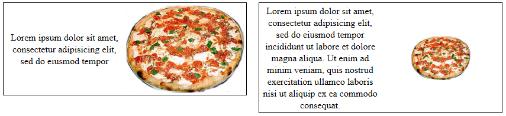
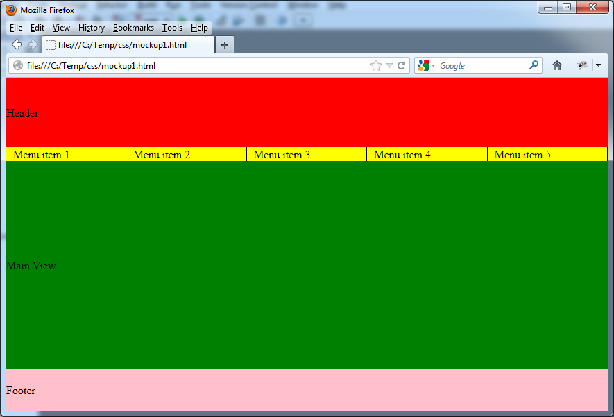
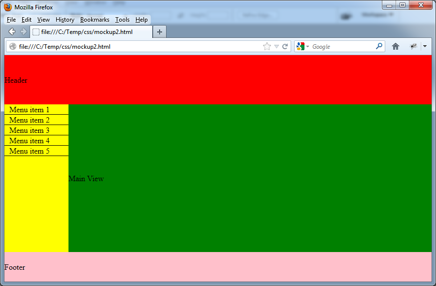
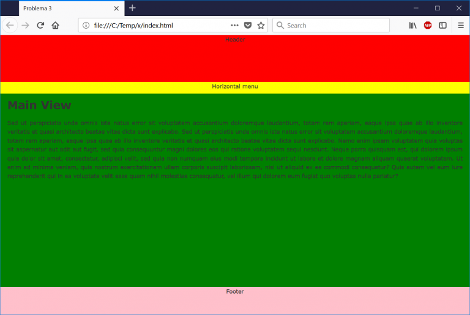
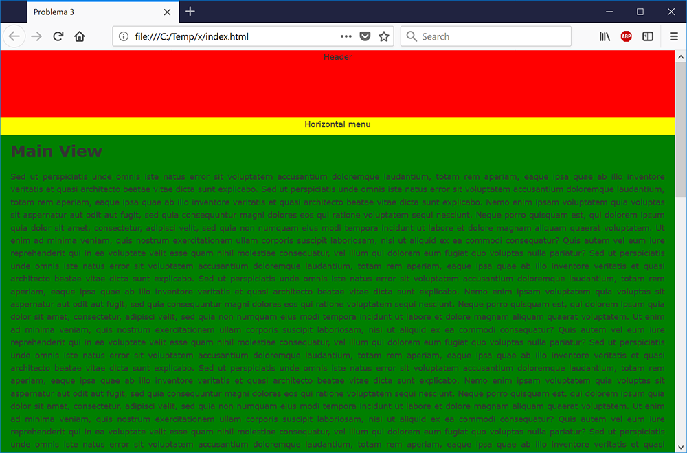
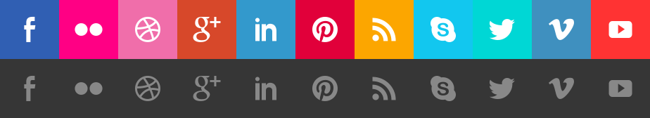
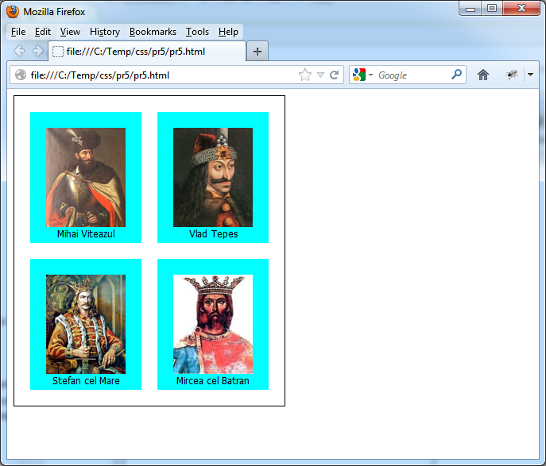
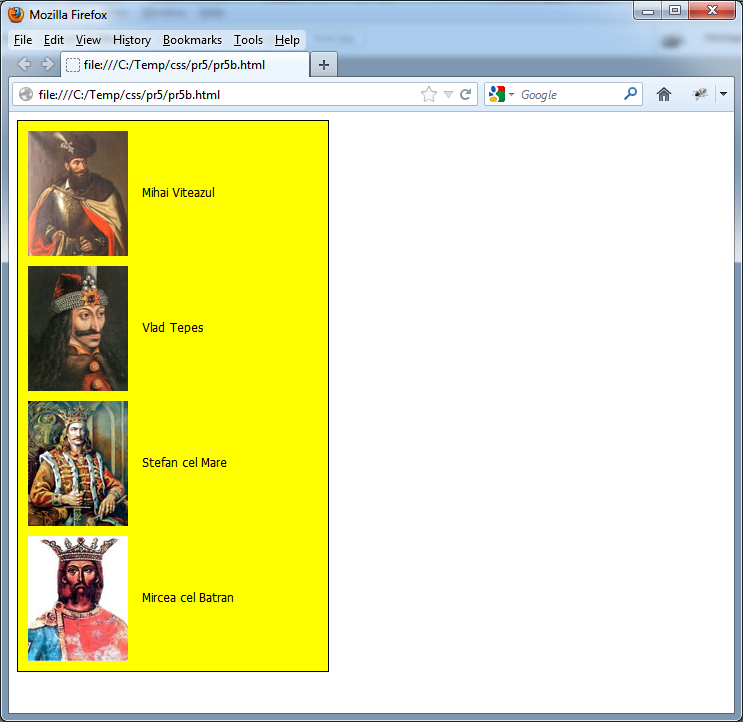
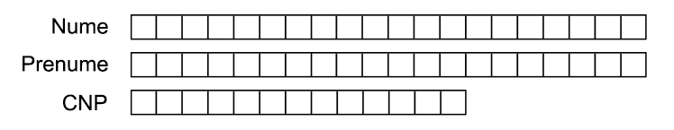
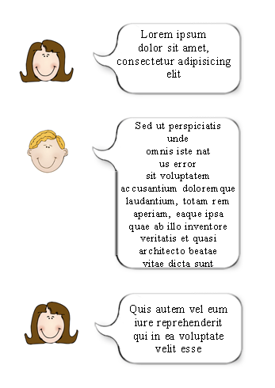

# LABORATOR CSS

## Probleme:

1. Un div părinte (chenarul negru) va conține două divuri interioare, unul în stânga și unul în dreapta. Cele două div-uri interioare au fiecare lățimea fixă de 200 de pixeli. Div-ul interior din stânga conține text centrat orizontal, iar div-ul interior din dreapta conține o imagine cu lățimea cel mult 200 de pixeli, centrată și ea orizontal dacă lățimea sa este mai mică de 200 de pixeli. Cele două div-uri interioare vor avea aceeași înălțime (în funcție de conținutul lor), aceasta fiind evident și înălțimea div-ului părinte. Dacă înălțimea div-ului interior din dreapta (cel cu imaginea) este mai mare decât înălțimea div-ului interior din stânga (cel cu textul) – datorită faptului că înălțimea imaginii din dreapta este mai mare decât înălțimea pe care o ocupă textul – în div-ul interior din stânga textul va fi centrat și pe verticală. Dacă înălțimea div-ului interior din stânga este mai mare decât înălțimea div-ului interior din dreapta – datorită faptului că înălțimea ocupată de text este mai mare decât înălțimea imaginii – în div-ul interior din dreapta imaginea va fi centrată și pe verticală. Se pot folosi mai multe div-uri imbricate dacă este cazul. Codul CSS/HTML trebuie să se comporte corespunzător cerințelor de mai sus la schimbarea conținutului (text, respectiv imagine). Se vor testa toate combinațiile posibile (text mai înalt, imagine mai înaltă, imagine mai îngustă, etc). Important: înălțimea nu se fixează (se presupune că este necunoscută).

   Exemplu:

   

2. Să se descrie folosind cod HTML structura unui site ce conține: un header, un meniu (listă de elemente), o div principală cu conținut și un footer. Structura site-ului va fi apoi stilizată folosind cel puțin două fișiere CSS externe (referite pe rând în antetul paginii). Pentru unul din fișierele CSS meniul va fi orizontal, iar pentru celălalt vertical. Singurul lucru permis a se modifica între cele două variante de vizualizare a site-ului este numele fișierului CSS la care se face referire în antetul paginii. Nu se vor face modificări la structura documentului.
   <div style="display: flex">
      <div>
         
         <p><b>Exemplu de meniu orizontal</b></p>
      </div>
      <p></p>
      <div style="margin-left: 15px">
         
         <p><b>Exemplu de meniu vertical</b></p>
      </div>
   </div>

3. Un site conține un header (roșu), un meniu orizontal sau vertical (galben), o zonă principală cu conținut (verde) și un footer (roz). Se cere:

   - Site-ul va fi stilizat folosind CSS;
   - Header-ul va avea o înălțime fixă de 100 de pixeli;
   - Meniul va avea o înălțime de 25px și va fi redat printr-o listă, acesta putând fi fie orizontal (vezi figurile de mai jos), fie vertical în stânga div-ului principal;
   - Footer-ul va avea o înălțime fixă de 60 de pixeli;
   - Div-ul principal (de culoare verde, având conținutul "Main View" în exemplu) va ocupa toată lățimea ferestrei și toată înălțimea disponibilă a acesteia (după ce se scade înălțimea header-ului, a footer-ului și a meniului). Dacă este cazul, acest div poate avea o înălțime care să se adapteze la conținut, mai mare ca înălțimea ferestrei browserului (vezi figura de mai jos), caz în care browserul va afișa bara de scroll verticală din partea dreaptă. Dacă acest div are conținut minim, div-ul ce reprezintă footer-ul se va regăsi întotdeauna în partea de jos a ferestrei (footerul nu are voie să "urce" mai sus de marginea de jos a ferestrei browserului, dacă textul din div-ul verde e puțin, poate cel mult să fie "împins" în jos de mult conținut în div-ul verde). De asemenea, footerul poate fi "împins" în jos de un posibil meniu vertical cu multe elemente. Geometria site-ului se va păstra la redimensionarea ferestrei browserului;
   - Dacă utilizatorul îngustează lățimea ferestrei browserului până la o lățime minimă, geometria site-ului se va păstra, footerul fiind "împins" în jos la nevoie, afișându-se și o bară de scroll verticală.

     <div style="display: flex">
       <div></div>
       <div style="margin-left: 15px"></div>
     </div>

4. Folosind sprite-uri CSS, pe baza imaginii de mai jos, să se creeze un meniu de socializare vertical cu iconițele inițial dezactivate. La trecerea cursorului peste una dintre iconițele de socializare, aceasta va deveni activată (se va colora). Fiecare iconiță va fi inițial afișată doar dezactivată, fiind colorată doar la trecerea cursorului peste ea. Nu se va folosi JavaScript. Se va folosi fix imaginea de mai jos, aceasta nu se va decupa. Pe baza unor modificări minime în codul CSS, meniul de socializare vertical se va transforma într-unul orizontal.
   
5. O pagină HTML va conține o listă de imagini. Să se stilizeze această listă cu două stiluri diferite pentru a obține un efect vizual cât mai asemănător exemplelor de mai jos. Singurul lucru permis a se modifica între cele două variante de vizualizare a listei de imagini este numele fișierului CSS la care se face referire în antetul paginii. NU se vor face modificări la structura documentului, ambele rezolvări trebuie să conțină fix același cod HTML.

   <div style="display: flex">
      <div></div>
      <div style="margin-left: 15px"></div>
   </div>

6. Stilizați mai multe input-uri de tip text astfel încât completarea acestora să se facă asemănător figurii de mai jos. Input-urile vor accepta un caracter per "pătrățică". Nu este permisă folosirea mai multor input-uri pentru același câmp (pentru nume spre exemplu). Atributele CSS folosite (width, font-family, font-size, etc.) se vor combina/corespunzător cu atributele HTML (maxlength) pentru un efect corespunzător. Nu se vor accepta mai multe caractere în input decât se pot introduce "vizual".

   

7. Se dă următorul cod HTML:

   ```html
   <ul class="dialog">
   	<li class="alice">
   		Lorem ipsum dolor sit amet, consectetur adipisicing elit
   	</li>
   	<li class="bob">
   		Sed ut perspiciatis unde omnis iste nat us error sit voluptatem
   		accusantium doloremque laudantium, totam rem aperiam, eaque ipsa quae ab
   		illo inventore veritatis et quasi architecto beatae vitae dicta sunt
   	</li>
   	<li class="alice">
   		Quis autem vel eum iure reprehenderit qui in ea voluptate velit esse
   	</li>
   </ul>
   ```

   Să se stilizeze acest cod HTML folosind clasele CSS dialog, alice și bob pentru a se obține un efect vizual ca în figura de mai jos:

   

   Observații:

   - Lista va putea conține mai mult de trei elemente plasate în clasele "alice", "bob" (eventual și alte "personaje");
   - Colțurile ferestrei de dialog vor fi rotunjite;
   - Fereastra de dialog pentru fiecare personaj va avea o lățime și o înălțime minimă, valori ce se vor adapta în funcție de dimensiunea textului spus de fiecare personaj și de dimensiunile ferestrei browserului;
   - Textul din cadrul ferestrei de dialog va fi centrat pe orizontală;
   - Dacă textul din cadrul unui element al listei este foarte lung, fereastra de dialog "rostită" de Alice sau Bob se va redimensiona pe lățime, dacă fereastra browserului permite, și apoi pe înălțime, păstrând însă constante proporțiile colțurilor (nu se va redimensiona fereastra de dialog fără păstrarea proporțiilor acesteia);
   - Avatarele lui Alice și Bob vor fi încărcate dintr-un sprite (a se vedea problema 4).

### Referințe:

- [CSS Tutorial](http://www.w3schools.com/css/default.asp)
