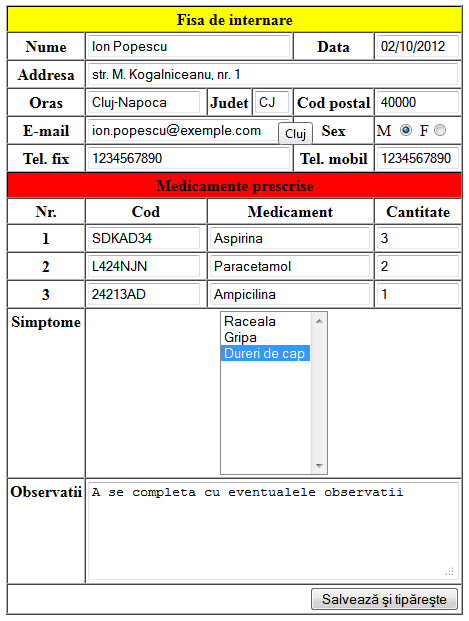

# LABORATOR HTML

## Cerință de implementare

La rezolvarea acestui laborator se vor folosi următoarele tag-uri: a, table (tr, th, td), div, strong, ul, ol, li, form, input, select, option, b, textarea, h1 (... h6), img, center, fieldset, legend, p, br, span și (absolut toate) următoarele atribute: href, name, target, border, colspan, align, valign, width, height, bgcolor, type, start, checked, disabled, maxlength, readonly, size, value, multiple, selected, cols, rows, max, alt, step, height, width, src, title. Nu se va folosi CSS.

Să se scrie o pagină web (în două variante: HTML 4.01 și HTML 5) ce conține un formular utilizat în viața reală. Un exemplu de astfel de formular este disponibil mai jos. Acesta este un exemplu, vă rog să vă imaginați un alt formular!!!

### Condiții de complexitate:

- cel puțin 15 controale de tip input, textarea, select;

- folosirea controalelor input de tip text, checkbox, radio;

- cel puțin 3 tabele din care două îmbinate (un tabel apare în interiorul unei celule a altui tabel);

- folosirea frecventă în cadrul laboratorului a atributelor rowspan și colspan;

- folosirea a minim 4 liste (ul sau ol) din care cel puțin 2 îmbinate;

- elementele celor patru liste de mai sus trebuie evidențiate diferit (spre exemplu o listă ordonată va avea elementele numerotate A, B, C, alta I, II, III);

- În cadrul formularului se vor folosi toate diacriticele din limba română;

- Se vor realiza două variante ale acestei teme de laborator: prima variantă trebuie verificată folosind http://validator.w3.org/ ca fiind un document HTML 4.01 Transitional valid (fără erori și fără warning-uri), iar a doua trebuie validată tot la link-ul anterior ca fiind un document HTML 5 valid (de asemenea fără erori și fără warning-uri);

## Referințe:

- [HTML Tutorial](https://www.w3schools.com/html/default.asp)
